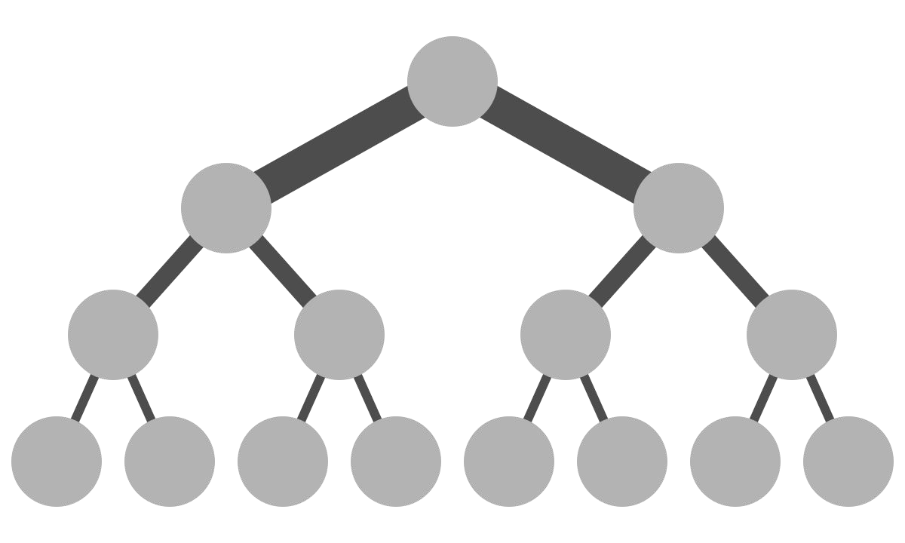
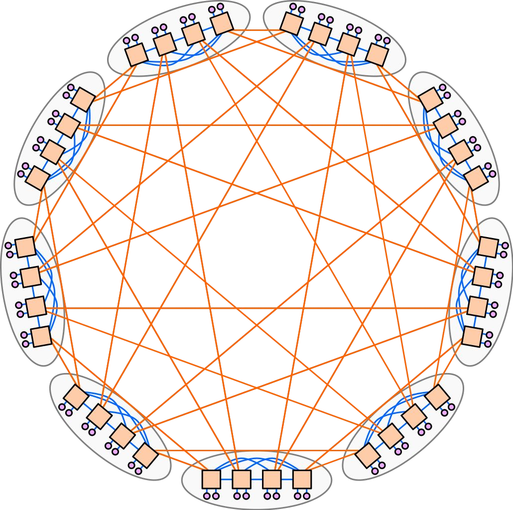
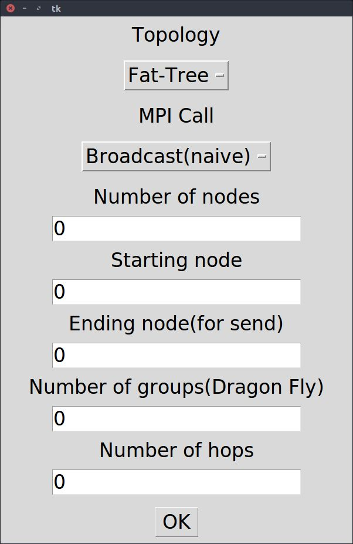
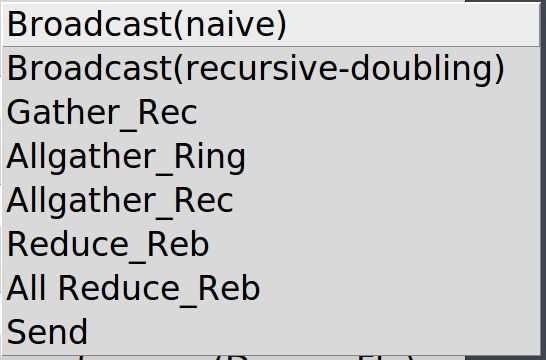
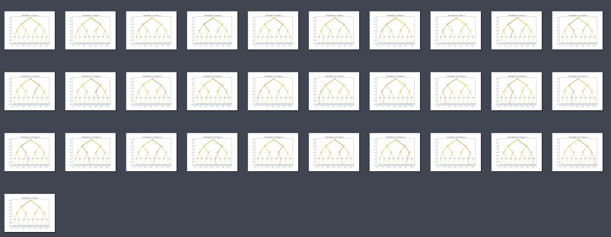
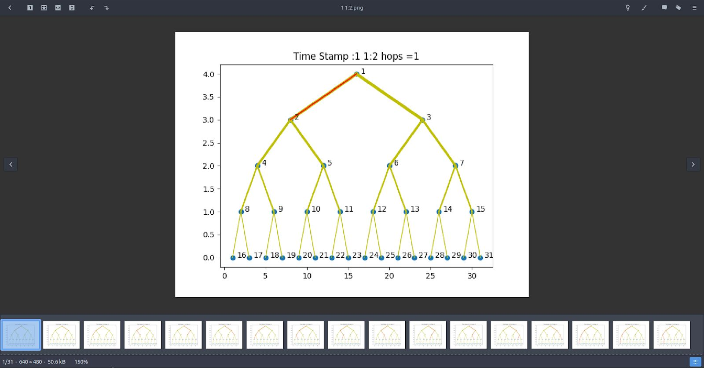
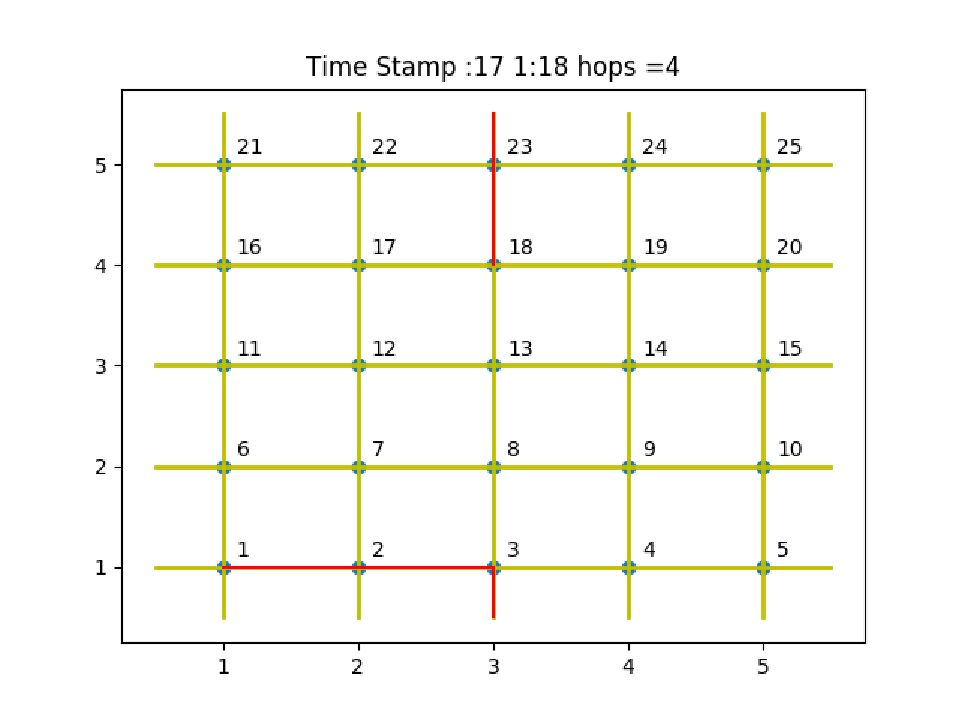
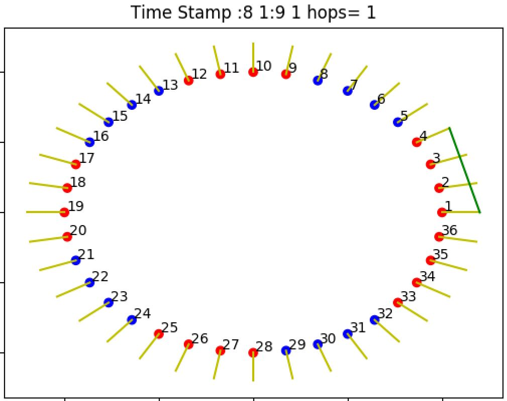

# MPICH Visualisation

## Introduction 
MPICH is a standard software used for message-passing for distributed-memory 
applications used in parallel computing. MPICH is Free and open source software. 

MPICH provides many MPI calls like Reduce , Broadcast , Send , Gather , etc to provide 
different functionality in parallel implementation of a code. 

This project is to show a visual representation of underlying message passing that happens among the nodes for various different function calls and on different topologies. 
## Project objective 
* Build a GUI application for the users to give configuration of the system 
* Show different kind topologies  
* Implement many different MPI calls on these topologies and show how the nodes 
are interacting among themselves for different functions  
* Calculate number of hops messages take in each phase and in total 
* Generate snapshots of event that happened during the communication for a 
specific function 
* Gallery to show the snapshots 
* Generate animated gif for a configuration 
## Physical Topologies Implemented :
|Topology|About|Image|
|---|---|---|
|Fat Tree |Nodes are arranged as nodes of a Binary Tree, with more links in upper levels than lower ||
|Torus|Torus is a mesh connection with extra links connecting the boundary nodes ||
|Dragonfly|Nodes are grouped and arranged in a circular manner||
## MPICH Functions Included :
* MPI_Send ( ) :
* MPI_Bcast ( ) :
    * Naive Algorithm
    * Binomial Tree
* MPI_Reduce ( ) :
* MPI_Allreduce ( ) :
    * Rabenseifner Algorithm
* MPI_Gather ( ) :
    * Recursive Doubling
* MPI_Allgather ( ) :
    * Recursive doubling Naive Algorithm
    * Rabenseifner Algorithm Recursive Doubling
---

## Dependencies
### Linux System
### Gthumb Image Viewer
```
sudo apt-get install gthumb
```
### Python Pip
```
sudo apt install python3-pip
```
### Upgrade Pip
```
sudo pip3 install --upgrade pip
```
### Matplotlib Python Library
```
sudo pip3 install matplotlib
```
### Python tTkinter Library
```
sudo apt-get install python3-tk
```
---
## Run Code
* Clone repository 
```
git clone https://github.com/ft-abhishekgupta/mpich-visualisation
```
* Copy **code** to Home Directory
* Change permission for home
```
sudo chown root.<username> /home/<username>/.local/share/gvfs-metadata/home
sudo rm ~/.local/share/gvfs-metadata/home
```
* Replace ```<username>``` with system user name
* Change Directory to *Code*
* Run main file.
```
python3 main.py
```
---
## Screenshots






---